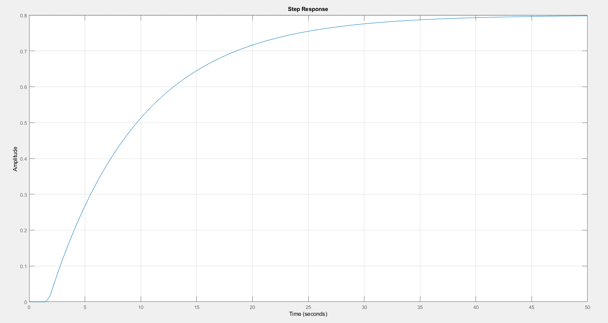
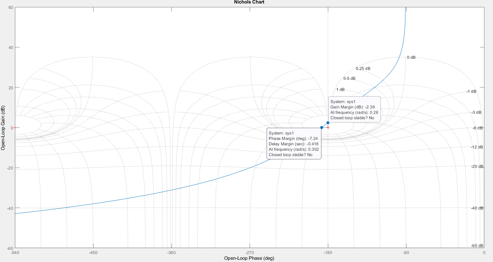
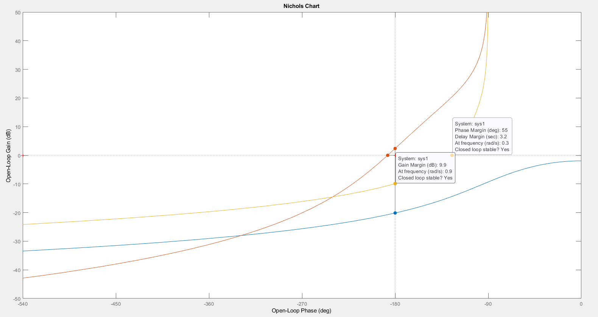
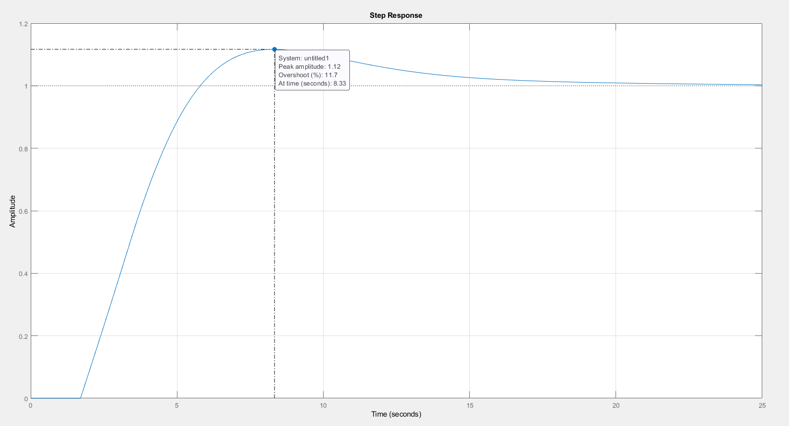
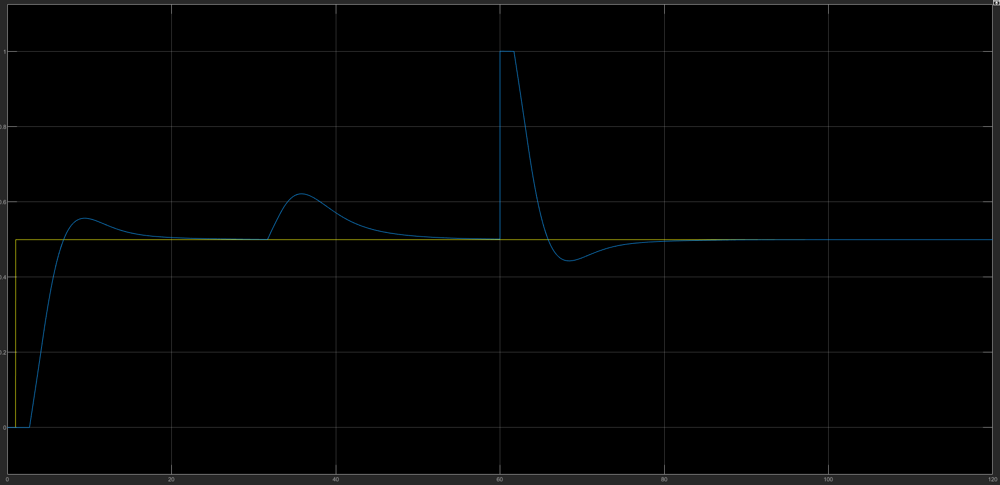
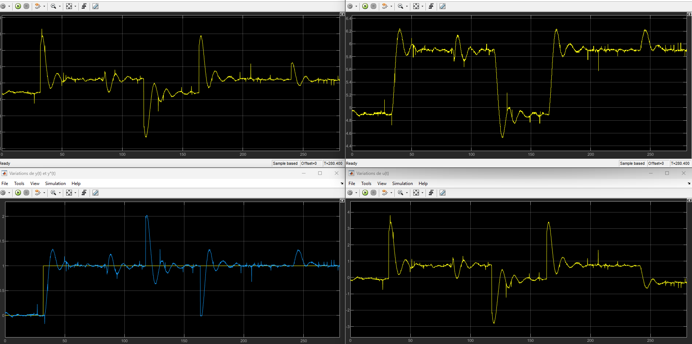

# Asservissement d'un aérotherme en temps réel

Asservissement en température d'un **aérotherme** (tube PVC à flux d'air chaud ascendant) piloté en **temps réel** via **Raspberry Pi + Matlab/Simulink**. Projet réalisé en Licence EEEA (Université de Caen Normandie).

> Identification du procédé → synthèse d'un correcteur **PD + intégrateur** → validation en simulation → expérimentation sur système réel.

---

## 🎯 Objectif

Réguler la température en sortie de l'aérotherme pour qu'elle suive une consigne, malgré le retard et l'inertie thermique du système.

**Cahier des charges :**
- Erreur de position **nulle** en poursuite et en régulation
- Dépassement de la réponse indicielle **< 15 %**
- Temps du 1er maximum **= 10 s**
- Marges de stabilité suffisantes

---

## ⚙️ Dispositif expérimental

```
PC + Simulink  ──Ethernet──►  Raspberry Pi 3  ──SPI──►  Carte AD/DA 12 bits  ──►  Aérotherme
   (superviseur)                (temps réel)            (conversion ±10 V)        (résistance + thermocouple)
```

- **Résistance chauffante** alimentée par une tension de commande 0–10 V
- **Thermocouple** en sortie, mesure renvoyée en 0–10 V
- Acquisition / commande temps réel à cadence fixe via Simulink + Embedded Coder (code C généré et exécuté sur la Raspberry)

---

## 🔬 Démarche

### 1. Identification du procédé
Le procédé se comporte comme un **premier ordre avec retard pur** :

$$G(p) = \frac{0{,}8}{1 + 8{,}1\,p}\, e^{-1{,}7\,p}$$

- Gain statique : 0,8
- Constante de temps : 8,1 s
- Retard pur : 1,7 s

### 2. Synthèse du correcteur
- **Intégrateur pur** `1/p` → annule l'erreur de position en régime permanent
- **Correcteur PD** `Kp·(Td·p + 1)` → réglé par la **méthode de la marge de phase** (Mφ = 55°) à la pulsation de coupure visée `wc = 3/tmax = 0,3 rad/s`

### 3. Validation
- Simulation en boucle fermée (`Boucle_fermee_sim.slx`)
- Expérimentation sur le système réel (`Aerotherme.slx`)
- Traitement et affichage des données sous Matlab (`Traitement.m`)

---

## 📁 Contenu du dépôt

| Fichier | Description |
|---|---|
| `src/TP6.m` | Synthèse du correcteur (identification, intégrateur + PD, tracés) |
| `src/Aerotherme.slx` | Modèle Simulink temps réel (cible Raspberry Pi) |
| `src/Boucle_fermee_sim.slx` | Modèle de simulation en boucle fermée |
| `src/Traitement.m` | Affichage des données expérimentales |
| `docs/rapport-asservissement-aerotherme.pdf` | Compte-rendu détaillé du projet |
| `results/` | Captures des courbes (réponses indicielle, Bode, Nichols) |

---

## 📊 Résultats

### 1. Identification — réponse indicielle du procédé
Comportement de premier ordre avec retard pur (gain ≈ 0,8 ; retard ≈ 1,7 s).



### 2. Pourquoi un correcteur PD ? — intégrateur seul instable
Avec un simple intégrateur pur, la boucle fermée est **instable** (marges négatives) → nécessité d'ajouter une action dérivée (PD).



### 3. Validation fréquentielle — marges de stabilité
Après réglage du PD : **marge de phase = 55°** à 0,3 rad/s, **marge de gain = 9,9 dB**, boucle fermée stable.



### 4. Réponse indicielle en boucle fermée
**Dépassement de 11,7 %** (< 15 % du cahier des charges ✓), erreur de position nulle en régime permanent.



### 5. Simulation — poursuite et rejet de perturbations
La sortie suit la consigne et rejette les perturbations d'entrée et de sortie.



### 6. Expérimentation temps réel (Raspberry Pi)
Validation sur le système réel : signaux de sortie `y(t)`, consigne `y*(t)` et commande `u(t)`.



### ✅ Bilan vis-à-vis du cahier des charges

| Spécification | Cible | Obtenu |
|---|---|---|
| Erreur de position | Nulle | Nulle (intégrateur) ✓ |
| Dépassement | < 15 % | 11,7 % ✓ |
| Marge de phase | Suffisante | 55° ✓ |
| Marge de gain | Suffisante | 9,9 dB ✓ |

---

## 🛠️ Compétences mises en œuvre

`Automatique` · `Asservissement` · `Identification de système` · `Correcteur PD / PID` ·
`Matlab` · `Simulink` · `Control System Toolbox` · `Temps réel` · `Raspberry Pi` · `SPI` · `Embedded Coder`

---

*Kousseila Fereka — Licence EEEA, Université de Caen Normandie*
